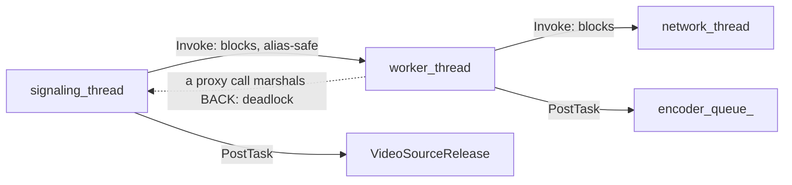

# CLAUDE.md

Guidance for Claude Code when working in this repository.

## What this is

A vendored fork of upstream WebRTC (m88-era), consumed by Open WebRTC Toolkit
and built into the Ambient appliance's `webrtc_server`. Ambient has touched 18
of the 6690 files here; the other 6672 are upstream's and should stay that way.

Almost every Ambient change reduces **signalling-thread latency** on a WebRTC
message path, in one of two ways:

1. Reduce cross-thread work that can deadlock.
2. Make resource allocation and release asynchronous.

Both categories are easy to get subtly wrong, and the failure modes are a
release-build hang with no log line, or a use-after-free on a task queue. The
rules below exist because those bugs were caught in review on PRs #3, #4, #6
and #7 — not as generic C++ advice.

## Thread model

| Thread / queue | Accessor | Owns |
|---|---|---|
| signalling | `signaling_thread()` | SDP, transceivers, proxies, most `PeerConnection` state |
| worker | `worker_thread()` | channel media, `*_w` methods, encoder lifecycle, `Call` |
| network | `network_thread()` | ICE, DTLS, RTP transport, SCTP, `*_n` methods |
| `encoder_queue_` | per `VideoStreamEncoder` | encode, rate updates |
| `worker_queue_` | per `VideoSendStreamImpl` | send-stream state |
| `"VideoSourceRelease"` | `pc/video_track.cc:39-49` | Ambient-added; process-lifetime, never joined |



Method-name suffixes are load-bearing: `_w` worker, `_n` network, `_s`
signalling. **Signalling, worker and network may be the same `rtc::Thread`** —
`rtc::Thread::Invoke` / `Send` tolerate that; `std::condition_variable::wait`,
a bare `Event::Wait`, `Thread::Join` and `std::future::get` do not.

## The three things to know before editing

1. **Never call a signalling-thread proxy from inside a blocking worker or
   network `Invoke`.** Use `internal()` there. The Ambient same-thread fast
   path tests `IsCurrent()` on the *target* thread, so it does not save you.
2. **Every behaviour change is gated on
   `AmbientFlags::MessageExecutionOptimization()`**, with the flag-off branch
   textually identical to upstream — duplication included.
3. **There is no CI.** Verification is `ninja owt` in the appliance container
   plus a subscribe/hangup load run, and the PR body reports coverage per
   change, honestly.

## Ambient-touched files

The whole fork surface — 18 files, one of them new:

| File | What Ambient added |
|---|---|
| `api/ambient_flags.h` | the flag (new file, header-only) |
| `api/proxy.h` | same-thread fast path in the four zero-arg macros |
| `api/video/video_stream_encoder_interface.h` | `StopAsync()` no-op default |
| `pc/peer_connection.{h,cc}` | batched `DestroyAllChannels`, deferred channel create/destroy, transceiver prune, stats-sweep gates, `PushdownMediaDescription(…, enable_sending)` |
| `pc/video_track.cc` | `VideoSourceReleaseThread`, async `~VideoTrack` |
| `pc/video_rtp_receiver.{h,cc}` | `DetachSinkOnWorker`, `sink_detached_` |
| `pc/channel{,_interface}.h` | `DisableMedia_w` promoted to a virtual |
| `video/video_stream_encoder.{h,cc}` | `PostStopTask`, `StopAsync`, `stop_posted_`, `stopped_` |
| `video/video_send_stream.{h,cc}`, `call/video_send_stream.h` | `StopEncoderAsync` |
| `media/base/media_channel.h`, `media/engine/webrtc_video_engine.{h,cc}` | `StopEncodersAsync` |

To regenerate that list after an upstream roll:

```bash
git diff --name-status 18721dffbee8 HEAD    # last pre-Ambient commit
```

Full symbol inventory and the sixteen flag-gate sites:
`.claude/rules/ambient-fork.md`.

## Build and verify

```bash
ninja owt        # in the appliance container; must produce the full libowt.a
```

Then run the subscribe/hangup load against the resulting `webrtc_server` and
record publishes, unpublishes, fatals, and which changed paths were actually
reached. The local client typically never answers the offer, so renegotiation
paths are usually **not** exercised — say so rather than glossing it.

Searches should target `origin/main`; a checkout may be on a branch without the
full tree:

```bash
git grep -n "Invoke<\|->Send(" origin/main -- pc/ video/ media/ call/
```

## Conventions

| Topic | Where |
|---|---|
| Which thread work runs on; proxy marshalling and `internal()`; alias-safe waits; `Invoke` vs `PostTask` captures; thread annotations | `.claude/rules/thread-affinity.md` |
| Resource release ordering; queue-side guards; drain points; idempotency flags; destructor offload; release-build teardown invariants | `.claude/rules/async-teardown.md` |
| `AmbientFlags` gating, upstream fidelity, gate sites, Ambient-added symbols, no CI | `.claude/rules/ambient-fork.md` |
| Finding and proposing a thread-hop or async-teardown change, and the PR write-up template | `.claude/skills/optimize-message-path/SKILL.md` |
| The catalogue of shapes that landed, with the invariant and guard for each | `.claude/skills/optimize-message-path/RECIPES.md` |
| What Bugbot blocks on in review | `.cursor/BUGBOT.md` |

Style is `.clang-format`'s; do not reformat upstream code the change does not
otherwise touch. New Ambient code follows the surrounding upstream style.

Commit subjects are imperative and under ~72 characters; the body states cost,
then mechanism, then guard, then measurement. Credit review provenance inline
(`Reported by Bugbot on #4.`).

Adding a rule, skill or Ambient symbol requires updating the corresponding
index in the same PR — the tables in `.claude/rules/README.md`,
`.claude/skills/README.md`, `.cursor/BUGBOT.md` and this file.
